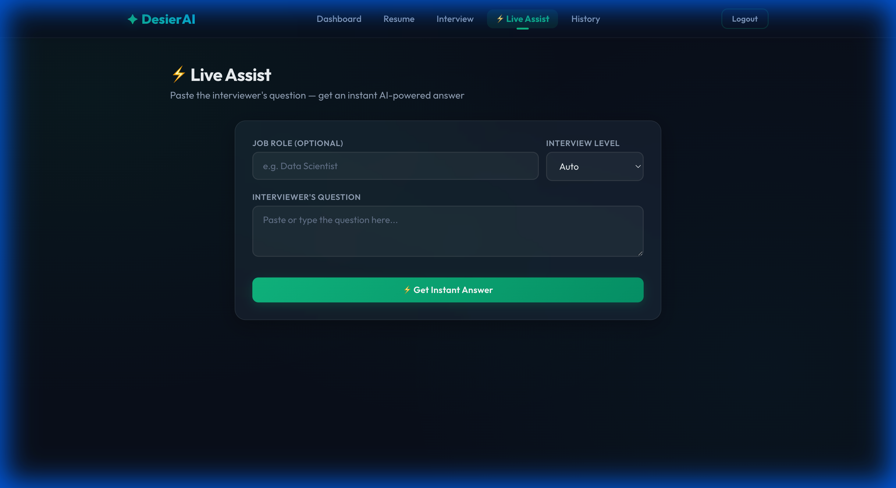

# ✦ DesierAI – Intelligent Interview Assistant

**Your AI-powered "second brain" for live coding interviews.**  
DesierAI sits quietly on your desktop (invisible to screen sharing) and provides real-time, context-aware answers to interview questions.




## 🚀 Key Features

### 🧠 Intelligent "Human-Like" Context
- **Session Memory**: Remembers the entire interview conversation (last 20 turns).
- **Trajectory Analysis**: Understands if the interviewer is digging deeper or changing topics.
- **Reference Handling**: "Can you optimize *that*?" — it knows what *that* refers to!
- **Auto-Level Detection**: Automatically detects if a question is Junior, Mid, or Senior level.

### 🕵️‍♂️ Stealth Mode (Desktop App)
- **Invisible Overlay**: Floating window uses macOS `sharingType = .none` to be **invisible to screen sharing** (Zoom/Meet/Teams).
- **Focus Protection**: Interact with the AI without stealing keyboard focus from your code editor.
- **Ghost Mode**: No dock icon, no App Switcher entry (`Cmd+Tab`). Toggle with `Cmd+Shift+D`.

### 💻 Developer-First UI
- **Code Generation**: Returns clean, syntax-highlighted code blocks for technical questions.
- **One-Click Copy**: Dedicated copy buttons for answers and code.
- **Dark Glass Theme**: sleek, distraction-free UI matching macOS aesthetics.

## 🛠️ Tech Stack
- **Frontend**: Standard Web Tech (HTML/CSS/JS)
- **Desktop**: Electron (content protection, global shortcuts)
- **Backend**: FastAPI (Python)
- **AI Engine**: Groq (Llama-3 70B) for instant (<1s) inference

## 📦 Installation

### Prerequisites
- Node.js (v16+)
- Python (v3.9+)
- Groq API Key

### 1. Backend Setup
```bash
cd backend
python3 -m venv venv
source venv/bin/activate
pip install -r requirements.txt
# Create .env file with GROQ_API_KEY=...
uvicorn main:app --reload --port 8000
```

### 2. Desktop App
```bash
cd desktop
npm install
npm start
```

### 3. Build for Distribution (macOS)
To create a standalone `.dmg` app:
```bash
cd desktop
npm run build
# Output: desktop/dist/DesierAI-1.0.0-arm64.dmg
```

## 🎮 Usage
1. **Launch Backend**: Ensure `uvicorn` is running on port 8000.
2. **Launch Desktop App**: `npm start` in `desktop/`.
3. **Login**: Use your DesierAI credentials.
4. **Stealth Mode**: Press `Cmd+Shift+D` to toggle the overlay.
5. **Ask Away**: Type or paste a question. The AI will answer with full context of your session!

## 🤝 Contributing
1. Fork the repo
2. Create feature branch (`git checkout -b feature/amazing-feature`)
3. Commit changes (`git commit -m 'Add amazing feature'`)
4. Push to branch (`git push origin feature/amazing-feature`)
5. Open a Pull Request

---
*Built for the modern software engineer.*
